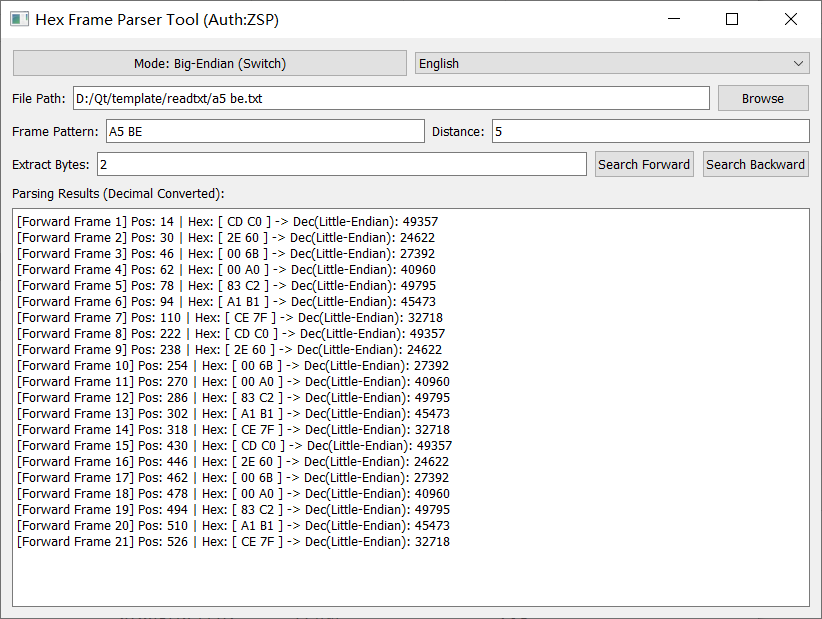
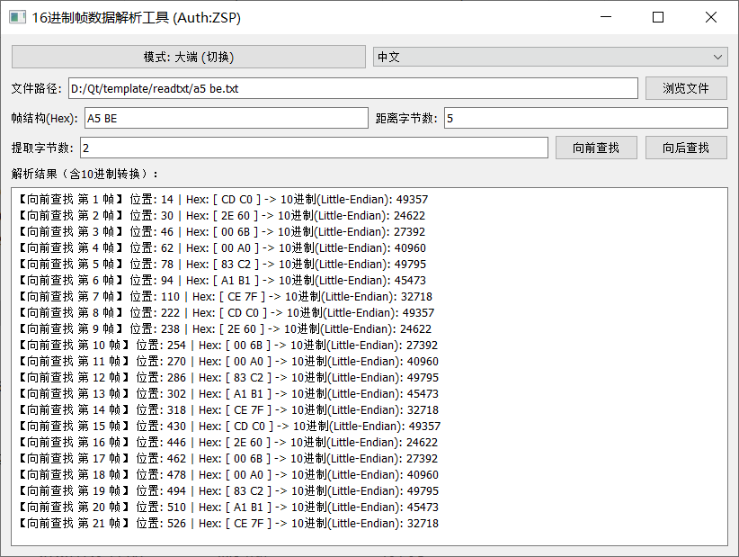

## The hexadecimal text file received by the data analyst consists of a long string of hexadecimal characters. This software is designed to locate specific bytes starting from a designated frame header position. Once the frame header is identified, the software allows for the sequential examination of characters at specific offsets from that header—supporting searches both forward and backward from the starting point. It also supports endianness conversion for two-byte and four-byte data, as well as hexadecimal-to-decimal conversion; other data—such as single-byte values ​​or sequences exceeding four bytes—are displayed as individual decimal and hexadecimal bytes.
يتكون ملف النص الست عشري الذي يتلقاه محلل البيانات من سلسلة طويلة من الأحرف الست عشرية. صُمم هذا البرنامج لتحديد مواقع بايتات معينة بدءًا من موضع محدد في رأس الإطار. بمجرد تحديد رأس الإطار، يتيح البرنامج فحص الأحرف بشكل متسلسل عند إزاحات محددة من ذلك الرأس، مما يدعم عمليات البحث للأمام والخلف من نقطة البداية. كما يدعم البرنامج تحويل ترتيب البايتات للبيانات ثنائية البايت ورباعية البايت، بالإضافة إلى التحويل من النظام الست عشري إلى النظام العشري؛ أما البيانات الأخرى، مثل القيم أحادية البايت أو التسلسلات التي تتجاوز أربعة بايتات، فتُعرض كبايتات عشرية وست عشرية منفصلة.
数据分析者拿到的16进制txt文档，是一连串的16进制字符长文本，需要从指定的帧头位置，找到需要字节，这个软件就是为了找到需要的字节，从帧头定位以后，对距离帧头一定距离的字符进行列队观察，可分为从帧头向前找和向后找，并支持两字节和四字节的大小端转换，16进制对10进制数字转换，其他单字节或超过四字节的字符，都以单字节10进制数字和16进制显示。

